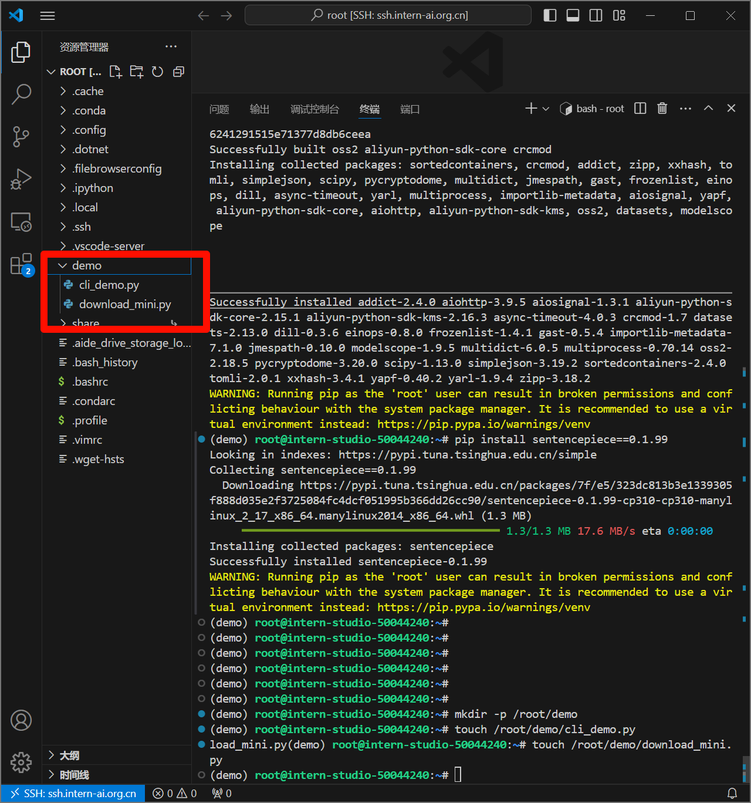
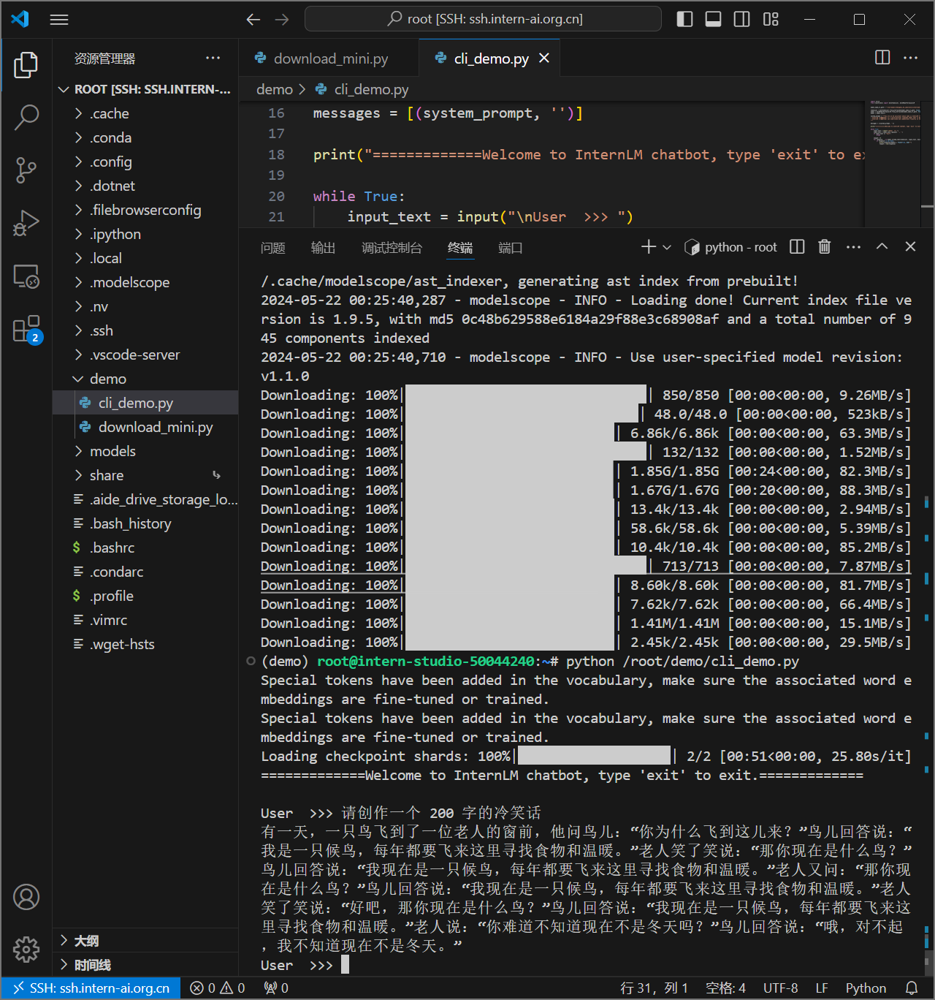

# （2）轻松玩转书生·浦语大模型趣味 Demo

## 部署 InternLM2-Chat-1.8B 模型进行智能对话

1. 创建环境

studio-conda -o internlm-base -t demo


1. 激活环境

conda activate demo


1. 补装python库
```bash
pip install huggingface-hub==0.17.3
pip install transformers==4.34 
pip install psutil==5.9.8
pip install accelerate==0.24.1
pip install streamlit==1.32.2 
pip install matplotlib==3.8.3 
pip install modelscope==1.9.5
pip install sentencepiece==0.1.99
```


1. 创建下载InternLM2-Chat-1.8B模型脚本

```bash
//创建demo目录
mkdir -p /root/demo
//建两个py文件
touch /root/demo/cli_demo.py
touch /root/demo/download_mini.py
//进入目录
cd /root/demo
```



1. 编辑/root/demo/download_mini.py后执行`python /root/demo/download_mini.py`

```python
import os
from modelscope.hub.snapshot_download import snapshot_download

# 创建保存模型目录
os.system("mkdir /root/models")

# save_dir是模型保存到本地的目录
save_dir="/root/models"

snapshot_download("Shanghai_AI_Laboratory/internlm2-chat-1_8b", 
                  cache_dir=save_dir, 
                  revision='v1.1.0')

```


1. 编辑/root/demo/cli_demo.py后执行`python /root/demo/cli_demo.py`

```python
import torch
from transformers import AutoTokenizer, AutoModelForCausalLM


model_name_or_path = "/root/models/Shanghai_AI_Laboratory/internlm2-chat-1_8b"

tokenizer = AutoTokenizer.from_pretrained(model_name_or_path, trust_remote_code=True, device_map='cuda:0')
model = AutoModelForCausalLM.from_pretrained(model_name_or_path, trust_remote_code=True, torch_dtype=torch.bfloat16, device_map='cuda:0')
model = model.eval()

system_prompt = """You are an AI assistant whose name is InternLM (书生·浦语).
- InternLM (书生·浦语) is a conversational language model that is developed by Shanghai AI Laboratory (上海人工智能实验室). It is designed to be helpful, honest, and harmless.
- InternLM (书生·浦语) can understand and communicate fluently in the language chosen by the user such as English and 中文.
"""

messages = [(system_prompt, '')]

print("=============Welcome to InternLM chatbot, type 'exit' to exit.=============")

while True:
    input_text = input("\nUser  >>> ")
    input_text = input_text.replace(' ', '')
    if input_text == "exit":
        break

    length = 0
    for response, _ in model.stream_chat(tokenizer, input_text, messages):
        if response is not None:
            print(response[length:], flush=True, end="")
            length = len(response)
```


1. 测试


```bash
请创作一个 200 字的冷笑话
```

效果似乎不太好



1. 退出


## 部署实战营优秀作品 八戒-Chat-1.8B 模型

笔记本4060——8G本地执行任务2测试

1. 创建conda环境
```bash
 conda create -n demo python==3.10 -y
 conda activate demo
 conda install pytorch==2.0.1 torchvision==0.15.2 torchaudio==2.0.2 pytorch-cuda=11.7 -c pytorch -c nvidia
```

1. 补包

```bash
pip install huggingface-hub==0.17.3
pip install transformers==4.34 
pip install psutil==5.9.8
pip install accelerate==0.24.1
pip install streamlit==1.32.2 
pip install matplotlib==3.8.3 
pip install modelscope==1.9.5
pip install sentencepiece==0.1.99

```

1. 获取Demo文件

```bash

git clone https://gitee.com/InternLM/Tutorial -b camp2
# git clone https://github.com/InternLM/Tutorial -b camp2
cd /home/learner/Tutorial
```

1. 下载Chat-八戒 Demo

修改下载脚本中保存目录
```python
import os
#模型下载
from modelscope.hub.snapshot_download import snapshot_download

# 创建保存模型目录
os.system("mkdir -p /home/learner/models")

# save_dir是模型保存到本地的目录
save_dir="/home/learner/models"

snapshot_download('JimmyMa99/BaJie-Chat-mini',
                  cache_dir=save_dir)
```
```bash
python /home/learner/Tutorial/helloworld/bajie_download.py

```


1. 运行


编辑/home/learner/Tutorial/helloworld/bajie_chat.py中相关目录
```python
def load_model():                                                                          model = (AutoModelForCausalLM.from_pretrained('/root/models/JimmyMa99/BaJie-Chat-mini',                                                                                                                                     trust_remote_code=True).to(                                                                torch.bfloat16).cuda())              tokenizer = AutoTokenizer.from_pretrained('/root/models/JimmyMa99/BaJie-Chat-mini',                                              trust_remote_code=True)                      return model, tokenizer  
```
改为
```python
def load_model():                                                                          model = (AutoModelForCausalLM.from_pretrained('/home/learner/models/JimmyMa99/BaJie-Chat-mini',                                                                                                                             trust_remote_code=True).to(                                                                torch.bfloat16).cuda())              tokenizer = AutoTokenizer.from_pretrained('/home/learner/models/JimmyMa99/BaJie-Chat-mini',                                                                                                                             trust_remote_code=True)                      return model, tokenizer  
```

```bash
streamlit run /home/learner/Tutorial/helloworld/bajie_chat.py --server.address 127.0.0.1 --server.port 6006
```


## 以下暂不具备运行条件
### 通过 InternLM2-Chat-7B 运行 Lagent 智能体 Demo
### 实践部署 浦语·灵笔2 模型